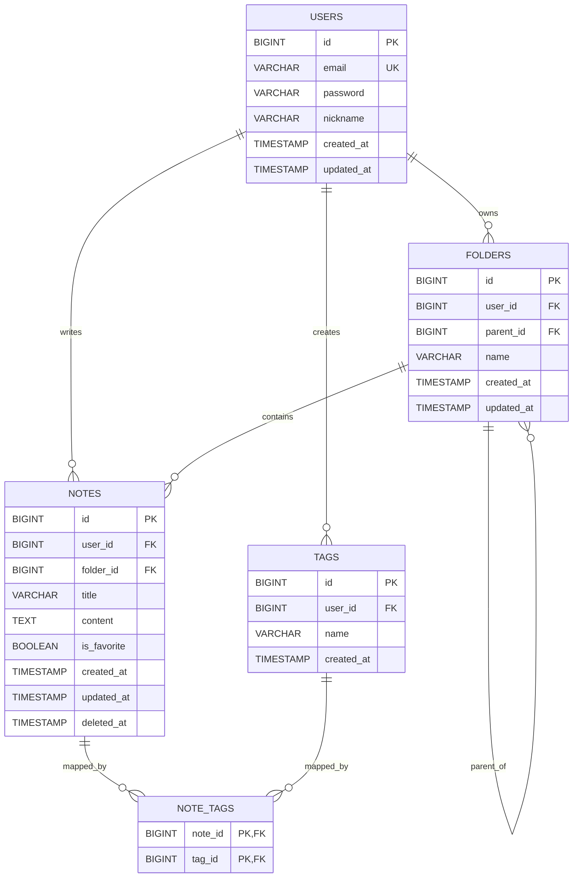

# Plain Note ERD

## 1. 개요

Plain Note는 노션보다 가볍고, 옵시디언보다 쉬운 클라우드 메모앱을 목표로 한다.

초기 MVP에서는 다음 기능을 지원하기 위한 데이터 구조를 설계한다.

- 회원가입 / 로그인
- 메모 생성 / 조회 / 수정 / 삭제
- 폴더 기반 정리
- 태그 기반 분류
- 검색
- 즐겨찾기
- 클라우드 저장

---

## 2. ERD 다이어그램

---

## 3. 테이블 설명

### 3.1 users

사용자 정보를 저장하는 테이블이다.

| 컬럼명 | 타입 | 제약조건 | 설명 |
|---|---|---|---|
| id | BIGINT | PK | 사용자 식별자 |
| email | VARCHAR(255) | NOT NULL, UNIQUE | 로그인 이메일 |
| password | VARCHAR(255) | NOT NULL | 암호화된 비밀번호 |
| nickname | VARCHAR(100) | NOT NULL | 사용자 닉네임 |
| created_at | TIMESTAMP | NOT NULL | 생성일시 |
| updated_at | TIMESTAMP | NOT NULL | 수정일시 |

#### 설명

- 하나의 사용자는 여러 개의 메모를 가질 수 있다.
- 하나의 사용자는 여러 개의 폴더를 가질 수 있다.
- 하나의 사용자는 여러 개의 태그를 가질 수 있다.

---

### 3.2 folders

메모를 폴더 단위로 정리하기 위한 테이블이다.

| 컬럼명 | 타입 | 제약조건 | 설명 |
|---|---|---|---|
| id | BIGINT | PK | 폴더 식별자 |
| user_id | BIGINT | FK, NOT NULL | 폴더 소유 사용자 |
| parent_id | BIGINT | FK, NULL | 상위 폴더 id |
| name | VARCHAR(100) | NOT NULL | 폴더 이름 |
| created_at | TIMESTAMP | NOT NULL | 생성일시 |
| updated_at | TIMESTAMP | NOT NULL | 수정일시 |

#### 설명

- 한 사용자는 여러 폴더를 가질 수 있다.
- 하나의 폴더는 여러 메모를 포함할 수 있다.
- `parent_id`를 통해 하위 폴더 구조를 지원할 수 있다.
- 초기 구현이 부담된다면 `parent_id` 없이 1단계 MVP를 시작해도 된다.

---

### 3.3 notes

메모의 핵심 내용을 저장하는 테이블이다.

| 컬럼명 | 타입 | 제약조건 | 설명 |
|---|---|---|---|
| id | BIGINT | PK | 메모 식별자 |
| user_id | BIGINT | FK, NOT NULL | 메모 작성 사용자 |
| folder_id | BIGINT | FK, NULL | 소속 폴더 |
| title | VARCHAR(200) | NOT NULL | 메모 제목 |
| content | TEXT | NOT NULL | 메모 본문 |
| is_favorite | BOOLEAN | NOT NULL, DEFAULT false | 즐겨찾기 여부 |
| created_at | TIMESTAMP | NOT NULL | 생성일시 |
| updated_at | TIMESTAMP | NOT NULL | 수정일시 |
| deleted_at | TIMESTAMP | NULL | 삭제일시 |

#### 설명

- 한 사용자는 여러 개의 메모를 가질 수 있다.
- 하나의 메모는 한 개의 폴더에 속하거나, 폴더 없이 존재할 수 있다.
- 메모는 여러 개의 태그를 가질 수 있다.
- `deleted_at`은 soft delete를 위한 컬럼이다.
- 초기에 hard delete로 구현하더라도 나중에 soft delete 확장이 가능하도록 남겨둘 수 있다.

---

### 3.4 tags

메모를 유연하게 분류하기 위한 태그 테이블이다.

| 컬럼명 | 타입 | 제약조건 | 설명 |
|---|---|---|---|
| id | BIGINT | PK | 태그 식별자 |
| user_id | BIGINT | FK, NOT NULL | 태그 소유 사용자 |
| name | VARCHAR(50) | NOT NULL | 태그 이름 |
| created_at | TIMESTAMP | NOT NULL | 생성일시 |

#### 설명

- 태그는 사용자별로 관리한다.
- 같은 이름의 태그라도 사용자마다 별도로 가질 수 있다.
- `UNIQUE(user_id, name)` 제약을 두는 것을 권장한다.

---

### 3.5 note_tags

메모와 태그의 다대다 관계를 연결하는 중간 테이블이다.

| 컬럼명 | 타입 | 제약조건 | 설명 |
|---|---|---|---|
| note_id | BIGINT | PK, FK | 메모 id |
| tag_id | BIGINT | PK, FK | 태그 id |

#### 설명

- 하나의 메모는 여러 태그를 가질 수 있다.
- 하나의 태그는 여러 메모에 연결될 수 있다.
- 복합 기본키 `(note_id, tag_id)`를 사용한다.

---

## 4. 관계 정리

### users : folders

- `1 : N`
- 한 사용자는 여러 폴더를 가진다.

### users : notes

- `1 : N`
- 한 사용자는 여러 메모를 가진다.

### users : tags

- `1 : N`
- 한 사용자는 여러 태그를 가진다.

### folders : notes

- `1 : N`
- 하나의 폴더는 여러 메모를 포함할 수 있다.

### folders : folders

- `1 : N`
- 하나의 폴더는 여러 하위 폴더를 가질 수 있다.
- 자기 자신을 참조하는 self-reference 구조이다.

### notes : tags

- `N : M`
- 하나의 메모는 여러 태그를 가진다.
- 하나의 태그는 여러 메모에 연결된다.
- `note_tags` 테이블로 관계를 표현한다.

---

## 5. 제약조건 및 규칙

### users

- `email`은 유일해야 한다.

### folders

- 같은 사용자는 동일한 상위 폴더 아래에서 같은 이름의 폴더를 중복 생성하지 않도록 제한할 수 있다.
- 예: `UNIQUE(user_id, parent_id, name)`

### tags

- 같은 사용자는 동일한 이름의 태그를 중복 생성하지 않도록 한다.
- 예: `UNIQUE(user_id, name)`

### notes

- 제목은 비어 있을 수 없도록 한다.
- 본문은 빈 문자열을 허용할지 정책으로 결정한다.
- 삭제된 메모는 `deleted_at IS NOT NULL`로 관리할 수 있다.

### note_tags

- 동일한 메모에 동일한 태그가 여러 번 연결되지 않도록 복합 PK를 둔다.

---

## 6. 검색 관련 메모

검색을 위해 초기 MVP에서는 별도 테이블을 두지 않는다.

초기 검색 대상은 다음과 같다.

- `notes.title`
- `notes.content`
- `tags.name`

추후 확장 시 다음 기능을 고려할 수 있다.

- PostgreSQL Full Text Search
- 태그 기반 필터 검색
- 폴더 기반 필터 검색
- 즐겨찾기 필터링

---

## 7. 초기 구현 우선순위

초기 구현은 다음 순서를 권장한다.

1. `notes` 기본 CRUD
2. `folders` 연결
3. `tags`, `note_tags` 연결
4. `users` 인증 연결
5. 검색 기능 추가

---

## 8. MVP 단순화 버전

초기 구현이 너무 복잡하면 아래처럼 단순화해서 시작할 수 있다.

### 먼저 빼도 되는 것

- `folders.parent_id`
- `notes.deleted_at`
- `notes.is_favorite`

### 먼저 남겨야 하는 것

- `users`
- `notes`
- `folders`
- `tags`
- `note_tags`

즉, 최소 MVP에서는 다음 정도만으로도 시작 가능하다.

- 사용자
- 메모
- 폴더
- 태그
- 메모-태그 연결

---

## 9. 현재 결정

초기 개발에서는 먼저 `notes` 중심으로 API를 구현한다.

처음부터 모든 테이블을 한 번에 구현하지 않고, 다음 순서로 확장한다.

1. 메모 CRUD
2. 공통 예외 처리
3. DB 연결
4. 사용자 인증
5. 폴더
6. 태그
7. 검색